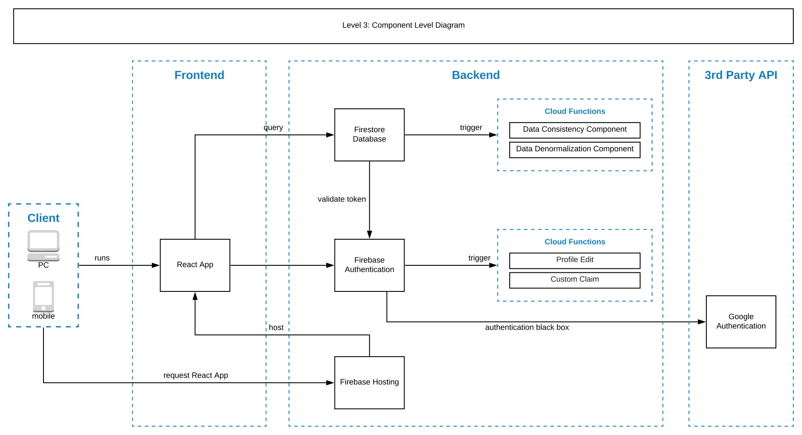
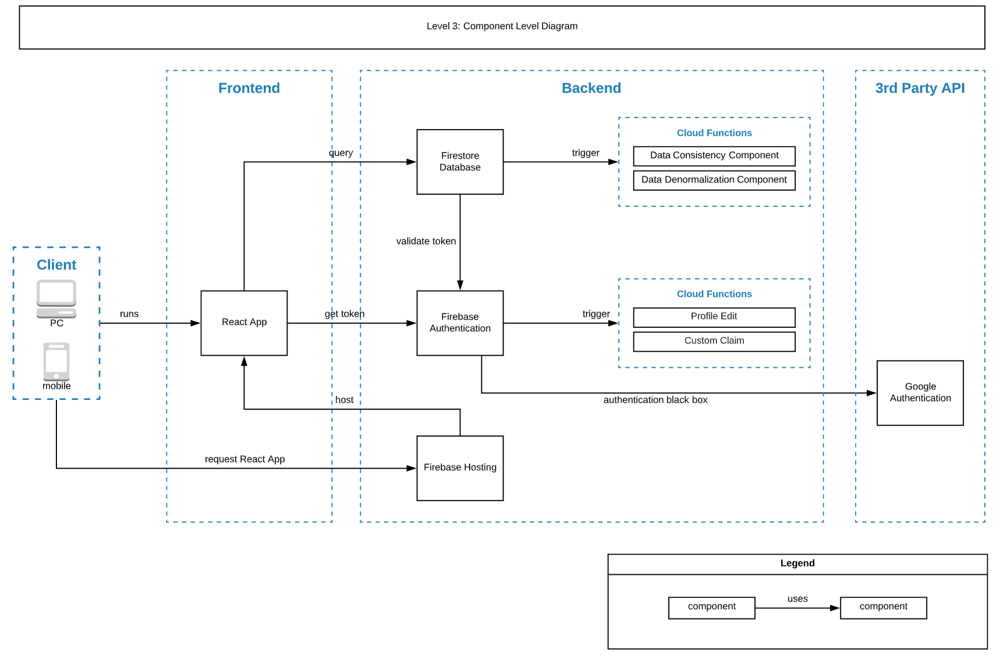
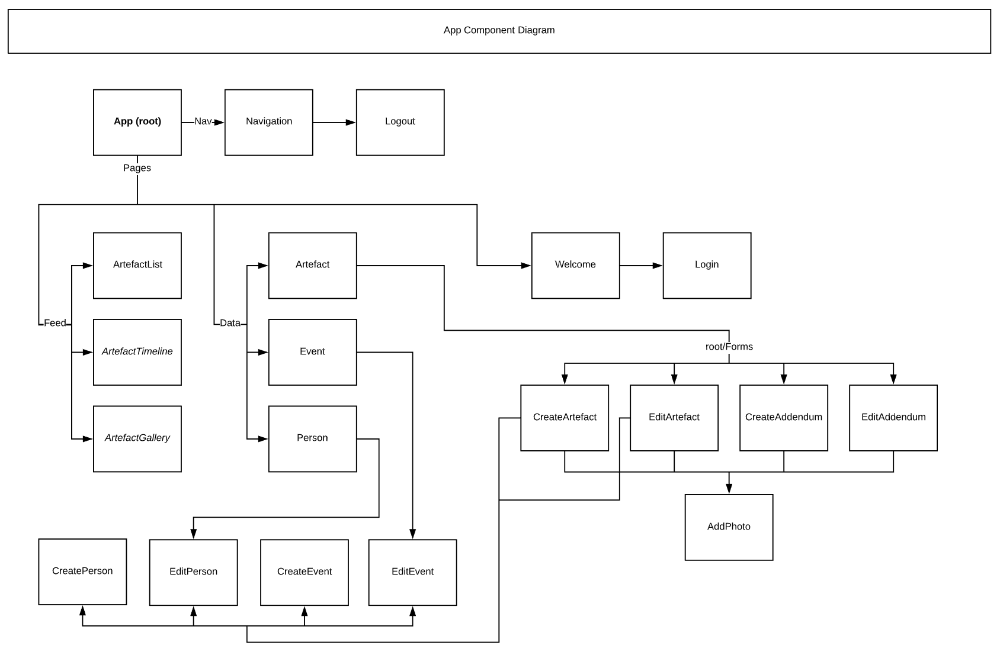

UNIMELB COMP30022 IT Project 2019

Branches:
`dev` branch is for development.
- Changes made should pass a code review!
	  
`front_end` is for front_end development and testing.

Architecture


# Heirloom22 Project!
this project is developed using [ReactJs](https://reactjs.org/), [Redux](https://redux.js.org/) & [Firebase](https://firebase.google.com).
Below you will find some information on how to perform common tasks.

## Table of Contents
- [Updates](#updates)
- [Available Scripts](#available-scripts)
    - [yarn start](#yarn-start)
    - [yarn test](#yarn-test)
    - [yarn run build](#yarn-run-build)
- [Folder Structure](#folder-structure)
- [Application Structure](#Application-structure)
- [Supported Browsers](#supported-browsers)
- [Supported Language Features and Polyfills](#supported-language-features-and-polyfills)

## Updates

16/9 **User Profile** modal is now swithable, it has additional content: [Edit Profile] for user inputs new profile data by Luoming

15/9 Antd is enabled in project now, re-designed **User Profile** into a modal by Luoming

To use Antd component, can **import 'antd'** (see example below):

```javascript
import { Button } from 'antd';
```

12/9 Frontend & Backend integration by Luoming

11/9 User profile prototype by Luoming

9/9  User Authentication (login/logout/signin) by Luoming


README last update 16/9 by Luoming

## Available Scripts

In the project directory, you can run:

### `yarn install`

- Installs all relevant module dependencies.
- [**YARN**](https://yarnpkg.com/lang/en/) is a dependency manager just like _npm_, if you are interested in **YARN** vs **npm**, [Here](https://www.sitepoint.com/yarn-vs-npm/) provides insight.
- To install **YARN**, please click [**Here**](https://yarnpkg.com/lang/en/docs/install/#mac-stable)

### `yarn start`

- Runs the app in the development mode at localhost port 3000.

The page will reload if you make edits.<br>
You will also see any lint errors in the console.

### `yarn test`

- Launches the test runner in the interactive watch mode.<br>

### `yarn run build`

- Builds the app for production to the `build` folder.

## Folder Structure

```
Heirloom22/
  README.md
  node_modules/
  package.json
  package-lock.json
  yarn.lock
  firebase.json
  public/
    index.html
    favicon.ico
    logo192.png
    logo512.png
  src/
    App.css
    App.js
    App.test.js
    index.css
    index.js
    logo.svg
    img/
    component/
        artefacts/
            Artefact.js
            Artefact.css (unused)
            ArtefactList.js
            ArtefactList.css (unused)
            ArtefactListElement
        auth/
            SignIn.js
            SignUp.js
        layout/
            nav.html (unused)
            Navigation.js
            SignedIn.js (unused)
            SignedOut.js (unused)
        profile/
            editProfile.js
            userProfile.js
        firebase/
            config.js
        store/
            Actions/
                userActions.js
            Reducer/
                rootReducer.js
                userReducer.js

```

## Application Structure





## Supported Browsers

By default, the generated project uses the latest version of React.

You can refer to the [React documentation](https://reactjs.org/docs/react-dom.html#browser-support) for more information about supported browsers.

## Supported Language Features and Polyfills

This project supports a superset of the latest JavaScript standard.<br>
In addition to [ES6](https://github.com/lukehoban/es6features) syntax features, it also supports:

* [Exponentiation Operator](https://github.com/rwaldron/exponentiation-operator) (ES2016).
* [Async/await](https://github.com/tc39/ecmascript-asyncawait) (ES2017).
* [Object Rest/Spread Properties](https://github.com/sebmarkbage/ecmascript-rest-spread) (stage 3 proposal).
* [Dynamic import()](https://github.com/tc39/proposal-dynamic-import) (stage 3 proposal)
* [Class Fields and Static Properties](https://github.com/tc39/proposal-class-public-fields) (part of stage 3 proposal).
* [JSX](https://facebook.github.io/react/docs/introducing-jsx.html) and [Flow](https://flowtype.org/) syntax.

Learn more about [different proposal stages](https://babeljs.io/docs/plugins/#presets-stage-x-experimental-presets-).

While we recommend using experimental proposals with some caution, Facebook heavily uses these features in the product code, so we intend to provide [codemods](https://medium.com/@cpojer/effective-javascript-codemods-5a6686bb46fb) if any of these proposals change in the future.
