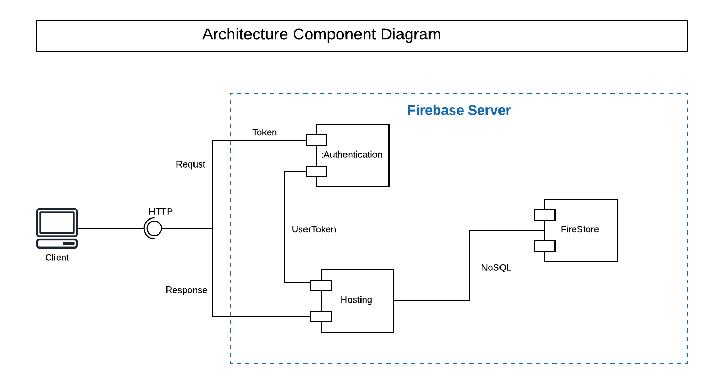
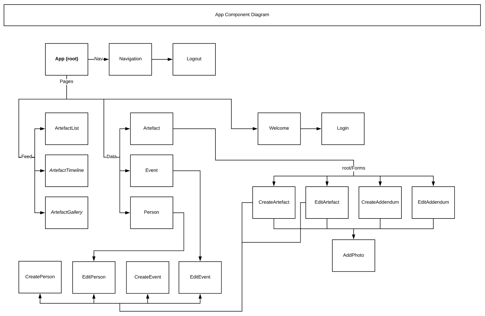

# Architecture

## Architecture Design Diagram

We started with a simple design

Here is a component level diagram that shows the dependency of the components

Sadly we weren't able to implement all the features

Here is the architecure component diagram of the final product

## Backend Design Diagram

We started the database design where People, Artifacts, and Events can have addendums.

After meeting with the client we decided to only allow artifacts to have addendums since there isn't any use cases for adding addendums to a person or an event. 

Here is the database model of the final product

## Frontend Design Diagram

Here is a simple high level view of the nesting structure of React components 

This app component diagram was created to communicate the React front-end architecture among the team.  

 

